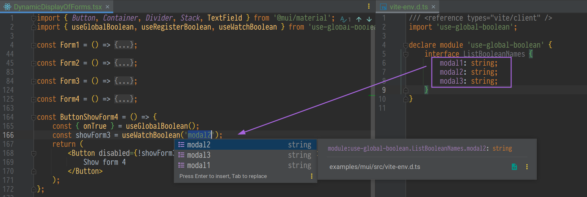

# useGlobalBoolean

[](https://github.com/Dima9119708/use-global-boolean)
[](https://www.npmjs.com/package/use-global-boolean)


`useGlobalBoolean` is a hook for managing global boolean variables. 
It can be used to open modals, sidebars, disable elements on a page, 
hide elements, and pass any arguments to the `onTrue` function. 
These arguments are then accessible through the `useBooleanController` hook.

## 🔧 Installation

```sh
# Using yarn.
yarn add use-global-boolean

# Using npm.
npm install use-global-boolean
```

## 🔎 Usage

To use this hook, you'll need `useGlobalBoolean` and `useBooleanController`:

```jsx
// At the top of your file.
import { useGlobalBoolean, useBooleanController } from "use-global-boolean";

// First, register a modal with a unique name.
const WelcomeModal = () => {
    const [opened, { onFalse }] = useBooleanController('modal_welcome');

    return (
        <dialog open={opened}>
            <button type="button" onClick={onFalse}>Close</button>
        </dialog>
    );
}

// Now, trigger our modal from anywhere in the application.
const Header = () => {
    const { onTrue } = useGlobalBoolean();

    return (
        <header>
            {/* ... */}
            <div role="menu">
                <button type="button" onClick={() => onTrue('modal_welcome')}>Welcome modal</button>
                <button type="button">Logout</button>
            </div>
        </header>
    );
}

const App = () => {
    return (
        <>
            <Header />
            <WelcomeModal />
        </>
    );
}

export default App
```

## 🫱🏿🫲🏿 Passing arguments
In addition to a boolean value, you can also pass data as a second argument, which can be of any type. Data can be passed as the second argument to onTrue and onToggle from useGlobalBoolean, as well as to globalBooleanActions.onTrue() and globalBooleanActions.onToggle()
```tsx
import { useGlobalBoolean, useBooleanController } from "use-global-boolean";

const EmailModal = () => {
    // Register the modal with a unique identifier and initial parameters
    const [opened, { data, onFalse }] = useBooleanController('email_modal', false, { email: '' });

    return (
      <dialog open={opened}>
         <input value={data.email} />
         <button type="button" onClick={onFalse}>Close</button>
         <button type="submit">Send email</button>
      </dialog>
    )
}

const Button = () => {
    const { onTrue } = useGlobalBoolean();

    // Button to open the email modal, passing parameters
    return <button onClick={() => onTrue('email_modal', { email: 'hello@world.com' })}>Open modal</button>
}

const App = () => (
    <>
        <Button />
        <EmailModal />
    </>
);
```

## 👀 watchBoolean / useWatchBoolean
We can break our components into smaller parts and track the changed state in a separate component using watchBoolean from useGlobalBoolean or the useWatchBoolean hook.
```tsx
import { useGlobalBoolean, useBooleanController, useWatchBoolean } from "use-global-boolean";

const Form = () => {
    // Using watchBoolean from useGlobalBoolean
    const { watchBoolean } = useGlobalBoolean();
    const [isEnabled] = watchBoolean('enable_form');

    // Or using useWatchBoolean directly
    // const [isEnabled] = useWatchBoolean('enable_form');


    return isEnabled && (
        <form>
            <label htmlFor="fname">First name:</label>
            <br />
            <input type="text" id="fname" name="fname" defaultValue="John" />
            <br />
            <label htmlFor="lname">Last name:</label>
            <br />
            <input type="text" id="lname" name="lname" defaultValue="Doe" />
            <br />
            <br />
            <input type="submit" value="Submit" />
        </form>
    );
}

const EnableForm = () => {
    const [checked, { onToogle }] = useBooleanController('enable_form');

    return (
        <label>
            <input
                type="checkbox"
                checked={checked}
                onChange={() => onToogle()}
            />
            Enable form
        </label>
       
    );
}

const App = () => {
    return (
        <>
            {/* ... */}
            <EnableForm />
            <Form />
            {/* ... */}
        </>
    );
}

export default App
```

## 🎛️ WatchController
If we prefer not to break the component into smaller parts and instead want to write all the logic within a single component, we can ensure that only the parts we want to re-render will be updated. Let's refactor the above example to use WatchController.

```tsx
import { WatchController } from "use-global-boolean";

const App = () => {
    return (
        <>
            <WatchController name="enable_form">
                {(props) => {
                    const [checked, { onToggle }] = props.localState;
                    return (
                        <label>
                            <input type="checkbox" checked={checked} onChange={() => onToggle()} />
                            Enable form
                        </label>
                    );
                }}
            </WatchController>
            <WatchController>
                {(props) => {
                    const [isEnabled] = props.globalMethods.watchBoolean('enable_form');

                    return (
                        isEnabled && (
                            <form>
                                <label htmlFor="fname">First name:</label>
                                <br />
                                <input type="text" id="fname" name="fname" defaultValue="John" />
                                <br />
                                <label htmlFor="lname">Last name:</label>
                                <br />
                                <input type="text" id="lname" name="lname" defaultValue="Doe" />
                                <br />
                                <br />
                                <input type="submit" value="Submit" />
                            </form>
                        )
                    );
                }}
            </WatchController>
        </>
    );
}

export default App
```

## 💪🏼 globalBooleanActions
If you need to change the state outside of a component.

```tsx
import { useEffect } from 'react';
import { globalBooleanActions } from 'use-global-boolean';

const externalLogic = () => {
    /* Logic... */

    globalBooleanActions.onTrue('dialog');
};

const Dialog = () => {
    const [show] = useBooleanController('dialog');

    return (
        <dialog open={show}>
            <p>This is a modal dialog controlled by external logic.</p>
        </dialog>
    );
};

const App = () => {
    useEffect(() => {
        // Call the external logic after the component is mounted
        externalLogic();
    }, []);

    return <Dialog />;
};

export default App;
```

## [](http://www.typescriptlang.org/) TypeScript 
```tsx
// use-global-boolean.d.ts
import 'use-global-boolean';

declare module "use-global-boolean" {
    interface ListBooleanNames {
        modal1: string;
        modal2: string;
        modal3: string;
    }
}

// Modal.tsx
import { useGlobalBoolean, useBooleanController, useWatchBoolean } from "use-global-boolean";

// Now TypeScript will provide suggestions:
useBooleanController('modal1'); // 'modal1', 'modal2', 'modal3'

const { onTrue, onToggle, watch } = useGlobalBoolean();
onTrue('modal1'); // 'modal1', 'modal2', 'modal3'
onToggle('modal1'); // 'modal1', 'modal2', 'modal3'
watchBoolean('modal1'); // 'modal1', 'modal2', 'modal3'

useWatchBoolean('modal1'); // 'modal1', 'modal2', 'modal3'
```



## Examples

[](https://codesandbox.io/p/devbox/mantine-example-w3ymgc?file=%2Fsrc%2Fmain.tsx%3A17%2C1&welcomeVSCode=true&layout=%257B%2522sidebarPanel%2522%253A%2522EXPLORER%2522%252C%2522rootPanelGroup%2522%253A%257B%2522direction%2522%253A%2522horizontal%2522%252C%2522contentType%2522%253A%2522UNKNOWN%2522%252C%2522type%2522%253A%2522PANEL_GROUP%2522%252C%2522id%2522%253A%2522ROOT_LAYOUT%2522%252C%2522panels%2522%253A%255B%257B%2522type%2522%253A%2522PANEL_GROUP%2522%252C%2522contentType%2522%253A%2522UNKNOWN%2522%252C%2522direction%2522%253A%2522vertical%2522%252C%2522id%2522%253A%2522clyzro5qi00072v6mkh9mr0x1%2522%252C%2522sizes%2522%253A%255B100%252C0%255D%252C%2522panels%2522%253A%255B%257B%2522type%2522%253A%2522PANEL_GROUP%2522%252C%2522contentType%2522%253A%2522EDITOR%2522%252C%2522direction%2522%253A%2522horizontal%2522%252C%2522id%2522%253A%2522EDITOR%2522%252C%2522panels%2522%253A%255B%257B%2522type%2522%253A%2522PANEL%2522%252C%2522contentType%2522%253A%2522EDITOR%2522%252C%2522id%2522%253A%2522clyzro5qi00022v6mjds1bwki%2522%257D%255D%257D%252C%257B%2522type%2522%253A%2522PANEL_GROUP%2522%252C%2522contentType%2522%253A%2522SHELLS%2522%252C%2522direction%2522%253A%2522horizontal%2522%252C%2522id%2522%253A%2522SHELLS%2522%252C%2522panels%2522%253A%255B%257B%2522type%2522%253A%2522PANEL%2522%252C%2522contentType%2522%253A%2522SHELLS%2522%252C%2522id%2522%253A%2522clyzro5qi00042v6mkzv1hsjn%2522%257D%255D%252C%2522sizes%2522%253A%255B100%255D%257D%255D%257D%252C%257B%2522type%2522%253A%2522PANEL_GROUP%2522%252C%2522contentType%2522%253A%2522DEVTOOLS%2522%252C%2522direction%2522%253A%2522vertical%2522%252C%2522id%2522%253A%2522DEVTOOLS%2522%252C%2522panels%2522%253A%255B%257B%2522type%2522%253A%2522PANEL%2522%252C%2522contentType%2522%253A%2522DEVTOOLS%2522%252C%2522id%2522%253A%2522clyzro5qi00062v6mykiftvek%2522%257D%252C%257B%2522type%2522%253A%2522PANEL%2522%252C%2522contentType%2522%253A%2522DEVTOOLS%2522%252C%2522id%2522%253A%2522clyzrrs2o008p2v6msui6cyfr%2522%257D%255D%252C%2522sizes%2522%253A%255B100%252C0%255D%257D%255D%252C%2522sizes%2522%253A%255B49.81034435052732%252C50.18965564947268%255D%257D%252C%2522tabbedPanels%2522%253A%257B%2522clyzro5qi00022v6mjds1bwki%2522%253A%257B%2522tabs%2522%253A%255B%257B%2522id%2522%253A%2522clyzro5qi00012v6mvu3acbq1%2522%252C%2522mode%2522%253A%2522permanent%2522%252C%2522type%2522%253A%2522FILE%2522%252C%2522filepath%2522%253A%2522%252FREADME.md%2522%252C%2522state%2522%253A%2522IDLE%2522%257D%252C%257B%2522id%2522%253A%2522clyzrs4ms00022v6mqjuizx85%2522%252C%2522mode%2522%253A%2522permanent%2522%252C%2522type%2522%253A%2522FILE%2522%252C%2522filepath%2522%253A%2522%252Fpackage.json%2522%252C%2522state%2522%253A%2522IDLE%2522%252C%2522initialSelections%2522%253A%255B%257B%2522startLineNumber%2522%253A26%252C%2522startColumn%2522%253A21%252C%2522endLineNumber%2522%253A26%252C%2522endColumn%2522%253A21%257D%255D%257D%252C%257B%2522id%2522%253A%2522clyzsgsns00022v6mhz3dbqyz%2522%252C%2522mode%2522%253A%2522permanent%2522%252C%2522type%2522%253A%2522FILE%2522%252C%2522initialSelections%2522%253A%255B%257B%2522startLineNumber%2522%253A17%252C%2522startColumn%2522%253A1%252C%2522endLineNumber%2522%253A17%252C%2522endColumn%2522%253A1%257D%255D%252C%2522filepath%2522%253A%2522%252Fsrc%252Fmain.tsx%2522%252C%2522state%2522%253A%2522IDLE%2522%257D%255D%252C%2522id%2522%253A%2522clyzro5qi00022v6mjds1bwki%2522%252C%2522activeTabId%2522%253A%2522clyzsgsns00022v6mhz3dbqyz%2522%257D%252C%2522clyzro5qi00062v6mykiftvek%2522%253A%257B%2522id%2522%253A%2522clyzro5qi00062v6mykiftvek%2522%252C%2522tabs%2522%253A%255B%257B%2522id%2522%253A%2522clyzro5qi00052v6mc25cogmx%2522%252C%2522mode%2522%253A%2522permanent%2522%252C%2522type%2522%253A%2522TASK_PORT%2522%252C%2522taskId%2522%253A%2522dev%2522%252C%2522port%2522%253A5173%252C%2522path%2522%253A%2522%252F%2522%257D%255D%252C%2522activeTabId%2522%253A%2522clyzro5qi00052v6mc25cogmx%2522%257D%252C%2522clyzro5qi00042v6mkzv1hsjn%2522%253A%257B%2522id%2522%253A%2522clyzro5qi00042v6mkzv1hsjn%2522%252C%2522activeTabId%2522%253A%2522clyzro5qi00032v6mwrx0tc6n%2522%252C%2522tabs%2522%253A%255B%257B%2522id%2522%253A%2522clyzro5qi00032v6mwrx0tc6n%2522%252C%2522mode%2522%253A%2522permanent%2522%252C%2522type%2522%253A%2522TASK_LOG%2522%252C%2522taskId%2522%253A%2522dev%2522%257D%252C%257B%2522type%2522%253A%2522TASK_LOG%2522%252C%2522taskId%2522%253A%2522pnpm%2520install%2520%2540mantine%252Fcore%25407.11.2%2522%252C%2522id%2522%253A%2522clyzs94lj008g2v6mmt2rqa9k%2522%252C%2522mode%2522%253A%2522permanent%2522%257D%252C%257B%2522type%2522%253A%2522TASK_LOG%2522%252C%2522taskId%2522%253A%2522pnpm%2520install%2520%2540mantine%252Fhooks%25407.11.2%2522%252C%2522id%2522%253A%2522clyzs9dtp00aa2v6ms8pkny12%2522%252C%2522mode%2522%253A%2522permanent%2522%257D%252C%257B%2522type%2522%253A%2522TASK_LOG%2522%252C%2522taskId%2522%253A%2522pnpm%2520install%2520%2540mantinex%252Fmantine-logo%25401.0.1%2522%252C%2522id%2522%253A%2522clyzs9ixk00c42v6mqsvs1uti%2522%252C%2522mode%2522%253A%2522permanent%2522%257D%252C%257B%2522type%2522%253A%2522TASK_LOG%2522%252C%2522taskId%2522%253A%2522pnpm%2520install%2520%2540tabler%252Ficons-react%25403.11.0%2522%252C%2522id%2522%253A%2522clyzs9nsp00dy2v6mqo0bysda%2522%252C%2522mode%2522%253A%2522permanent%2522%257D%252C%257B%2522type%2522%253A%2522TASK_LOG%2522%252C%2522taskId%2522%253A%2522pnpm%2520install%2520use-global-boolean%25400.0.1-alpha.2%2522%252C%2522id%2522%253A%2522clyzs9s6d00f22v6m3bidn4p1%2522%252C%2522mode%2522%253A%2522permanent%2522%257D%255D%257D%252C%2522clyzrrs2o008p2v6msui6cyfr%2522%253A%257B%2522tabs%2522%253A%255B%257B%2522id%2522%253A%2522clyzrrrj8008m2v6mfwttx8rx%2522%252C%2522mode%2522%253A%2522permanent%2522%252C%2522type%2522%253A%2522SANDBOX_INFO%2522%252C%2522isCloud%2522%253Atrue%257D%255D%252C%2522id%2522%253A%2522clyzrrs2o008p2v6msui6cyfr%2522%252C%2522activeTabId%2522%253A%2522clyzrrrj8008m2v6mfwttx8rx%2522%257D%257D%252C%2522showDevtools%2522%253Atrue%252C%2522showShells%2522%253Afalse%252C%2522showSidebar%2522%253Atrue%252C%2522sidebarPanelSize%2522%253A18.724018404665884%257D)
[](https://codesandbox.io/p/devbox/mui-example-5f9s32?layout=%257B%2522sidebarPanel%2522%253A%2522EXPLORER%2522%252C%2522rootPanelGroup%2522%253A%257B%2522direction%2522%253A%2522horizontal%2522%252C%2522contentType%2522%253A%2522UNKNOWN%2522%252C%2522type%2522%253A%2522PANEL_GROUP%2522%252C%2522id%2522%253A%2522ROOT_LAYOUT%2522%252C%2522panels%2522%253A%255B%257B%2522type%2522%253A%2522PANEL_GROUP%2522%252C%2522contentType%2522%253A%2522UNKNOWN%2522%252C%2522direction%2522%253A%2522vertical%2522%252C%2522id%2522%253A%2522clyzsvpbx00072v6mvp8yisu1%2522%252C%2522sizes%2522%253A%255B70%252C30%255D%252C%2522panels%2522%253A%255B%257B%2522type%2522%253A%2522PANEL_GROUP%2522%252C%2522contentType%2522%253A%2522EDITOR%2522%252C%2522direction%2522%253A%2522horizontal%2522%252C%2522id%2522%253A%2522EDITOR%2522%252C%2522panels%2522%253A%255B%257B%2522type%2522%253A%2522PANEL%2522%252C%2522contentType%2522%253A%2522EDITOR%2522%252C%2522id%2522%253A%2522clyzsvpbw00022v6mli0n4l9a%2522%257D%255D%257D%252C%257B%2522type%2522%253A%2522PANEL_GROUP%2522%252C%2522contentType%2522%253A%2522SHELLS%2522%252C%2522direction%2522%253A%2522horizontal%2522%252C%2522id%2522%253A%2522SHELLS%2522%252C%2522panels%2522%253A%255B%257B%2522type%2522%253A%2522PANEL%2522%252C%2522contentType%2522%253A%2522SHELLS%2522%252C%2522id%2522%253A%2522clyzsvpbw00042v6m5y4qtawy%2522%257D%255D%252C%2522sizes%2522%253A%255B100%255D%257D%255D%257D%252C%257B%2522type%2522%253A%2522PANEL_GROUP%2522%252C%2522contentType%2522%253A%2522DEVTOOLS%2522%252C%2522direction%2522%253A%2522vertical%2522%252C%2522id%2522%253A%2522DEVTOOLS%2522%252C%2522panels%2522%253A%255B%257B%2522type%2522%253A%2522PANEL%2522%252C%2522contentType%2522%253A%2522DEVTOOLS%2522%252C%2522id%2522%253A%2522clyzsvpbx00062v6my1zokkcy%2522%257D%255D%252C%2522sizes%2522%253A%255B100%255D%257D%255D%252C%2522sizes%2522%253A%255B48.417080829861305%252C51.582919170138695%255D%257D%252C%2522tabbedPanels%2522%253A%257B%2522clyzsvpbw00022v6mli0n4l9a%2522%253A%257B%2522tabs%2522%253A%255B%257B%2522id%2522%253A%2522clyzsvpbw00012v6meda2n4rx%2522%252C%2522mode%2522%253A%2522permanent%2522%252C%2522type%2522%253A%2522FILE%2522%252C%2522filepath%2522%253A%2522%252FREADME.md%2522%252C%2522state%2522%253A%2522IDLE%2522%257D%255D%252C%2522id%2522%253A%2522clyzsvpbw00022v6mli0n4l9a%2522%252C%2522activeTabId%2522%253A%2522clyzsvpbw00012v6meda2n4rx%2522%257D%252C%2522clyzsvpbx00062v6my1zokkcy%2522%253A%257B%2522tabs%2522%253A%255B%257B%2522id%2522%253A%2522clyzsvpbx00052v6m23art1fi%2522%252C%2522mode%2522%253A%2522permanent%2522%252C%2522type%2522%253A%2522TASK_PORT%2522%252C%2522taskId%2522%253A%2522dev%2522%252C%2522port%2522%253A5173%252C%2522path%2522%253A%2522%252F%2522%257D%255D%252C%2522id%2522%253A%2522clyzsvpbx00062v6my1zokkcy%2522%252C%2522activeTabId%2522%253A%2522clyzsvpbx00052v6m23art1fi%2522%257D%252C%2522clyzsvpbw00042v6m5y4qtawy%2522%253A%257B%2522tabs%2522%253A%255B%257B%2522id%2522%253A%2522clyzsvpbw00032v6mofceq3fg%2522%252C%2522mode%2522%253A%2522permanent%2522%252C%2522type%2522%253A%2522TASK_LOG%2522%252C%2522taskId%2522%253A%2522dev%2522%257D%255D%252C%2522id%2522%253A%2522clyzsvpbw00042v6m5y4qtawy%2522%252C%2522activeTabId%2522%253A%2522clyzsvpbw00032v6mofceq3fg%2522%257D%257D%252C%2522showDevtools%2522%253Atrue%252C%2522showShells%2522%253Atrue%252C%2522showSidebar%2522%253Atrue%252C%2522sidebarPanelSize%2522%253A15%257D)
                                                                                                                                                                                                                                                                                                                                                                                                                                                                                                                                                                                                                                                                                                                                                                                                                                                                                                                                                                                                                                                                                                                                              
